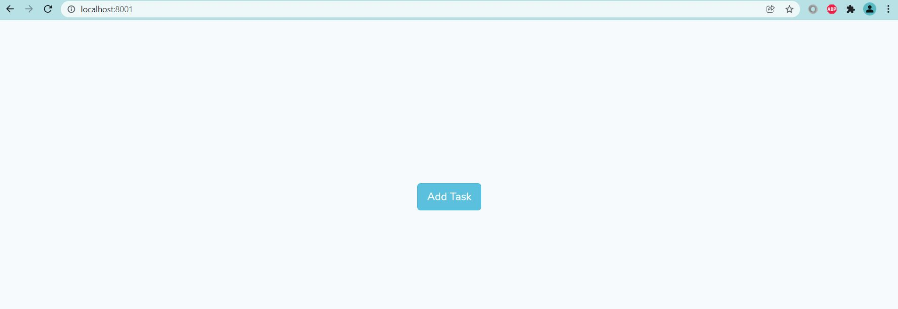
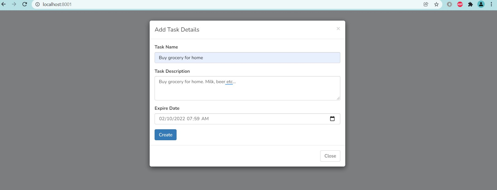
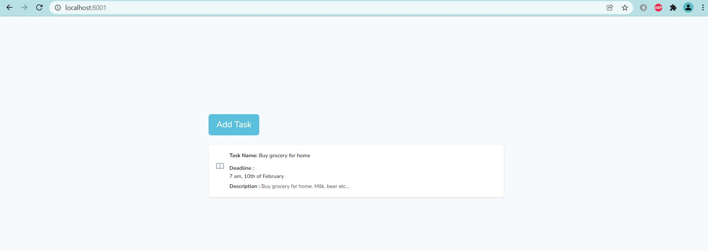

## About Task Recording App

The main feature of this Laravel 8 app is, timiezone identified according to the user location and convert user input date into particular timezone.

## The way to testing

```composer update```

  # .env file modify as below 

  ```DB_DATABASE=metaschool```
  ```DB_USERNAME=root```

  # finally 

  ``` php artisan migrate``` 
  ``` php artisan serve``` 

  # screenshots

  

  

  